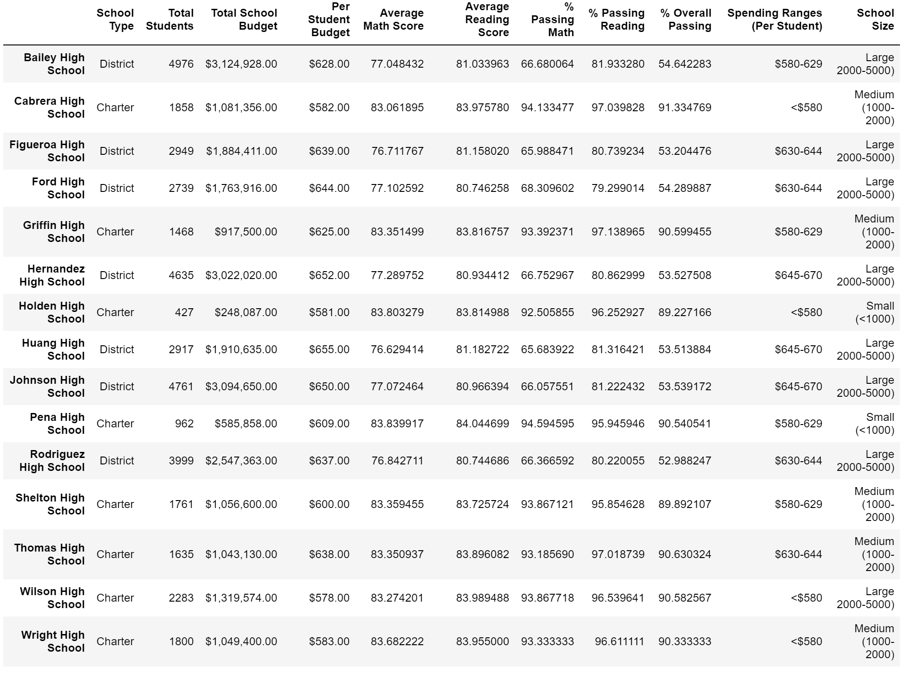

# School_District_Analysis

## Table of Contents
* [Overview of Project](https://github.com/rkaysen63/School_District_Analysis/blob/master/README.md#overview-of-project)
* [Resources](https://github.com/rkaysen63/School_District_Analysis/blob/master/README.md#resourcess)
* [Results](https://github.com/rkaysen63/School_District_Analysis/blob/master/README.md#results)
* [Summary](https://github.com/rkaysen63/School_District_Analysis/blob/master/README.md#summary)

## Overview of Project
A School District has requested help with analyzing district and student data in order to determine the top and bottom performing schools in the district and to see if school spending per capita, school size, or school type have any type of relationship to school peformance.  After the initial data was analyzed, it was discovered that math and reading scores from the 9th grade class of Thomas High School had to be removed from the data set because of evidence of academic dishonesty and the data re-analyzed.

Python through Jupyter Notebook interface was used to pull in and analyze data from two sources referenced below.

## Resources

* Data Sources:
  * students_complete.csv
  * schools_complete.csv
* Software: Python 3.7.9 in Jupyter Notebook interface
* Lesson Plan: UTA-VIRT-DATA-PT-02-2021-U-B-TTH, Module 4 Challenge
* Readme Markdown Help:
  * Reference resizing images: https://gist.github.com/MichaelPolla/a65ac84286ab523603e64549f985022

## Results
Results: Using bulleted lists and images of DataFrames as support, address the following questions.

* How is the district summary affected?
* How is the school summary affected?
* How does replacing the ninth graders’ math and reading scores affect Thomas High School’s performance relative to the other schools?
* How does replacing the ninth-grade scores affect the following:
* Math and reading scores by grade
* Scores by school spending
* Scores by school size
* Scores by school type

## Summary
Summarize four major changes in the updated school district analysis after reading and math scores for the ninth grade at Thomas High School have been replaced with NaNs.
