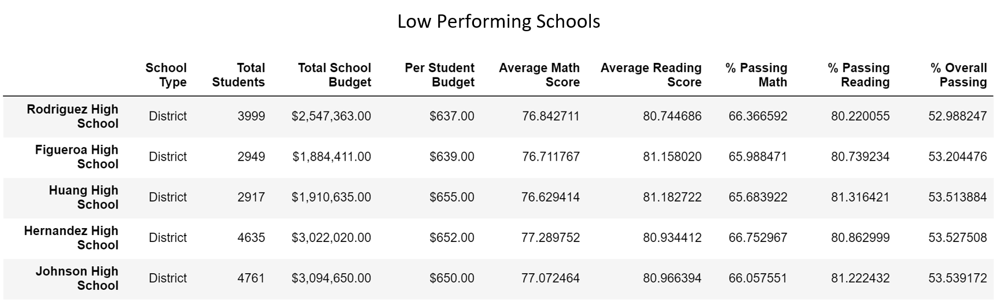

# School_District_Analysis

  

## Table of Contents
* [Overview of Project](https://github.com/rkaysen63/School_District_Analysis/blob/master/README.md#overview-of-project)
* [Resources](https://github.com/rkaysen63/School_District_Analysis/blob/master/README.md#resources)
* [Results](https://github.com/rkaysen63/School_District_Analysis/blob/master/README.md#results)
* [Summary](https://github.com/rkaysen63/School_District_Analysis/blob/master/README.md#summary)

## Overview of Project
City School System has requested help with analyzing district and student data to determine the top and bottom performing schools in the district and to see if school spending per capita, school size, or school type have any type of relationship to school performance.  After the initial data was analyzed, it was discovered that math and reading scores from the ninth grade class of Thomas High School (THS) had to be removed from the data set because of evidence of academic dishonesty and the data re-analyzed.  

The opening image compares the original `student_data_df`, lower dataframe, to the revised `student_data_df`, upper dataframe, where the ninth grade math and reading scores for THS were replaced with "NaN".  

Python through Jupyter Notebook interface was used to pull in and analyze data from the two sources referenced below.

## Resources

* Data Sources:
  * students_complete.csv
  * schools_complete.csv
* Software: Python 3.7.9 in Jupyter Notebook interface
* Lesson Plan: UTA-VIRT-DATA-PT-02-2021-U-B-TTH, Module 4 Challenge
* Readme Markdown Help:
  * Reference resizing images: https://gist.github.com/DavidWells/7d2e0e1bc78f4ac59a123ddf8b74932d

## Results

* ### District Summary 
  

  
  
  
  The image above shows a comparison of the "District Summary" dataframe, after Thomas High School's (THS) ninth grade math and reading scores were removed to the "District Summary" of the original analysis.  The effect is so small as to be considered negligible.  Only a difference of 0.1 points is seen in the Average Math Score for the district.  It is not a surprise that the removal of THS's ninth grade scores had so little impact on the overall district scores because there are 641 ninth graders at THS, which is only 1.6 % of the district's total student population of 39,169.

* ### School Summary 
  

  
  
  
  Since the "School Summary" dataframe displays the results by each school in the district, only the results of THS were affected by removing THS's ninth grade math and reading scores.  Compare the lines that are highlighted in gold.  The lower dataframe is from the original analysis.  The upper dataframe is the revised analysis that excludes THS's ninth graders' math and reading scores. THS's average math score went down < 0.1 points and their average reading score went up < 0.1 points by removing their ninth graders' scores.  The effect is so small as to be considered negligible.
  
* Because the effect of replacing the ninth graders' math and reading scores with "NaN" is negligible, Thomas High School's performance relative to the other schools did not change.

* ### Top Five Performing Schools
  

  
  
 
  The highest performing schools are shown above.  Since Thomas High School (THS), highlighted in gold in both dataframes, is included in the top 5, the top five schools are shown twice to demonstrate that THS's rank in the top five did not change as a result of removing its ninth grade math and reading scores from the data.
  
* ### Bottom Five Performing Schools
  

  
  
  
  The lowest performing schools are shown above. This dataframe is shown only one time because it did not change after removing THS's ninth graders' math and reading scores.
  
* ### Math and Reading Scores by Grade
  

  
  
   
  The comparison above of the original "Math Scores by Grade" and "Reading Scores by Grade" dataframes to the "Math Scores by Grade" and "Reading Scores by Grade" dataframes after removing THS's ninth graders' math and reading scores show that the ninth graders' scores appear as "NaN", i.e. a null value, in the revised dataframes.

* ### Scores by School Spending Per Capita
  

  
  
 
  The comparison above of the original "Scores by Spending Ranges (Per Student)" to the revised "Scores by Spending Ranges (Per Student)" after THS's ninth graders' math and reading scores were removed shows no difference in the results.  Per the results shown in "Scores by Spending Ranges (Per Student)", reading averages were about the same across the district regardless of the amount spent per student, whereas math scores decreased slightly for schools that spent more money per student.  It is an interesting result that may suggest that there are other factors involved, such as a more diverse population in larger schools.

* ### Scores by School Size
  

  
  
 
  The comparison above of the original "Scores by School Size" to the revised "Scores by School Size" after THS's ninth graders' math and reading scores were removed show no difference in the results.  Per the results shown in "Scores by School Size", math and reading averages were about the same for small and medium schools, but the math and reading scores decreased for larger schools.
  
* ### Scores by School Type
  

  
  
 
  The comparison above of the original "Scores by School Type" to the revised "Scores by School Type" after THS's ninth graders' math and reading scores were removed show no difference in the results.  Per the results shown in "Scores by School Type", Charter Schools performed slightly better than District Schools in both math and reading.

## Summary
* In order to provide a fair comparison across district schools, Thomas High School's ninth grade math and reading scores were removed from the dataframe, `student_data_df`, and replaced with null, i.e. "NaN".  The numpy dependency was imported in order to use `np.nan` to quickly substitute "NaN" in place of the ninth graders scores. `.loc[]` was used to locate "Thomas High School" and "9th" grade in the dataframe.  
     
    `import numpy as np`  
      
    `student_data_df.loc[(student_data_df["school_name"] == "Thomas High School") & (student_data_df["grade"] == "9th"), "reading_score"] = np.nan`  
      
  The revised `student_data_df` was merged with the `school_data_df` to form a new, "clean" `school_data_complete_df` that includes null ("NaN") values for THS's ninth graders' math and reading scores.

* In creating the District Summary, `district_summary_df`, the average math and reading scores were calculated from the "clean" `school_data_complete_df`, so that the mean of math and reading scores no longer included THS's ninth graders' scores because they are "NaN".  To illustrate, the district's average math score formula using the `.mean()` function is shown below.  
  
  `average_math_score = school_data_complete_df["math_score"].mean()`  
    
  In order to calculate the passing math, reading and overall percentages, the total student count had to be revised to exclude THS's ninth graders.  The ninth grade count was obtained by using the `.loc[].count()`to locate "Thomas High School" and "9th" and count the number of students that meet both criteria in the dataframe.  Then the ninth grade count was subtracted from THS's total student count.  
    
  `ths_9th_gr_count = school_data_complete_df.loc[(school_data_complete_df["school_name"] == "Thomas High School") & (student_data_df["grade"] == "9th"), "Student ID"].count()`  
  \
  `student_count = school_data_complete_df["Student ID"].count()`  
  \
  `student_count_wo_ths9th = student_count - ths_9th_gr_count` \
  \
  Passing rates were from the "clean" `school_data_complete_df`.  The code included a statement to pull only math, or reading, or both scores from the dataframe that are greater than or equal to 70. The steps to calculate overall passing math and reading percentage is shown below to illustrate.  First, a filtered dataframe is created to include only students that scored 70 or more in both math and reading.  Then the number of students that passed both were counted.  Finally, the number of students passing both math and reading were divided by the adjusted total student count, i.e. does not include THS's ninth graders, and multiplied by 100 percent.
  \
  `passing_math_reading = school_data_complete_df[(school_data_complete_df["math_score"] >= 70) & (school_data_complete_df["reading_score"] >= 70)]` \
  \
  `overall_passing_math_reading_count = passing_math_reading["student_name"].count()`  
  \
  `overall_passing_percentage = overall_passing_math_reading_count/float(student_count_wo_ths9th) * 100`  

* The procedure for creating the School Summary, `school_summary_df` without THS's ninth graders' math and reading scores, began exactly the same as for the original analysis, but required some correction.  Before the correction, THS's passing percentages were calculated using the total school count.  Therefore, the percentages are not correct because the data sample is less the ninth grader scores.  For this reason, the total count had to be reduced by the number of ninth graders.  As before, number of Series were created using the `df.groupby()` functionto calculate the mean for budget, math and reading and filtered dataframes were created for passing math and reading scores.  Example of calculating the average budget using `groupby()`:  
  
`per_school_budget = school_data_complete_df.groupby()["school_name"].mean()["budget"]`   
\
  The average math and reading scores for THS will reflect that the ninth graders' scores are "NaN".  But the percentages will not be correct because the school count was not adjusted to omit the ninth graders from the count.  In order to record the correct passing math, passing reading and passing overall percentages for THS, the correct number of students had to be calculated.  Since the ninth graders were taken out of the equation, the correct student count is the total number of students at THS minus total number of ninth graders, or in other words the number of students in grades ten through twelve.   
  \
  `ths_all_gr_count = school_data_complete_df.loc[(school_data_complete_df["school_name"] == "Thomas High School"), "Student ID"].count()`  
  \
  `ths_9th_gr_count = school_data_complete_df.loc[(school_data_complete_df["school_name"] == "Thomas High School") & (student_data_df["grade"] == "9th"), "Student ID"].count()`  
    
  `ths_gr10to12_count = ths_all_gr_count - ths_9th_gr_count`   
  \
  Once the number of students in grades ten through twelve at THS is calculated, new passing perecentages could be calculated.  For illustration, calculations for overall passing math and reading percentage is shown below. First, the number of students at THS passing both math and reading is calculated, i.e. the number of students scoring 70 or more in both math and reading is counted.  This result will already exclude the ninth graders' scores because their scores are null in the clean data set.  Then, the overall passing percentage is calculated by dividing the number of THS students scoring 70 or more in both math and reading by the total number of THS students in tenth through twelfth grades and then multiplying by 100 percent.
  \
  `ths_passing_math_reading_count = school_data_complete_df.loc[(school_data_complete_df["school_name"] == "Thomas High School") & (school_data_complete_df["math_score"] >= 70) & (school_data_complete_df["reading_score"] >= 70),"Student ID"].count()`  
  \
  `ths_10to12_passing_math_reading_percentage = ths_passing_math_reading_count / ths_gr10to12_count * 100`   
  \
  Finally, these new percentages had to be inserted into `school_summary_df`, replacing the ones that were there.   
  \
  `new_ths_passing_math_reading_percentage = per_school_summary_df.loc["Thomas High School", "% Overall Passing"] = ths_10to12_passing_math_reading_percentage` 
    
The remaining code to obtain determine high and low performing schools, math and reading scores by grade, scores by school spending per capita, scores by school size and scores by school type was the same as it was in the original analysis.
